# Software Architecture Document
## V1 Thermoelectric Measurement System
**Ikeda-Hamasaki Laboratory**  
Version 1.0 — March 2026

---

## Table of Contents

1. [System Overview](#1-system-overview)
2. [High-Level Architecture](#2-high-level-architecture)
3. [Backend Architecture](#3-backend-architecture)
4. [Frontend Architecture](#4-frontend-architecture)
5. [Hardware & Instrument Layer](#5-hardware--instrument-layer)
6. [IR Camera Subsystem](#6-ir-camera-subsystem)
7. [Data Flow Diagrams](#7-data-flow-diagrams)
8. [API Reference](#8-api-reference)
9. [Key Dependencies](#9-key-dependencies)
10. [Deployment](#10-deployment)
11. [Design Decisions & Trade-offs](#11-design-decisions--trade-offs)

---

## 1. System Overview

The **V1 Thermoelectric Measurement System** is a full-stack laboratory automation application that drives Keithley GPIB instruments to perform two primary electrical characterization workflows:

| Workflow | Instruments | Measured Quantities |
|---|---|---|
| **Seebeck Coefficient** | 2182A, 2700, PK160 | TEMF, T₁, T₂, ΔT, S (µV/K) |
| **I-V / Resistivity** | 6221 | V, I, R (Ω), ρ (Ω·m), σ (S/m) |

Additionally, an **Optris IR camera** subsystem streams live thermal imagery over WebSocket.

The system is structured as a **decoupled two-tier application**:

- **Backend** — Python FastAPI server running on the lab PC, controlling instruments via PyVISA over GPIB.
- **Frontend** — React (TypeScript/Vite) SPA that communicates with the backend over HTTP REST and WebSocket, and can be served locally or deployed to Firebase Hosting.

---

## 2. High-Level Architecture

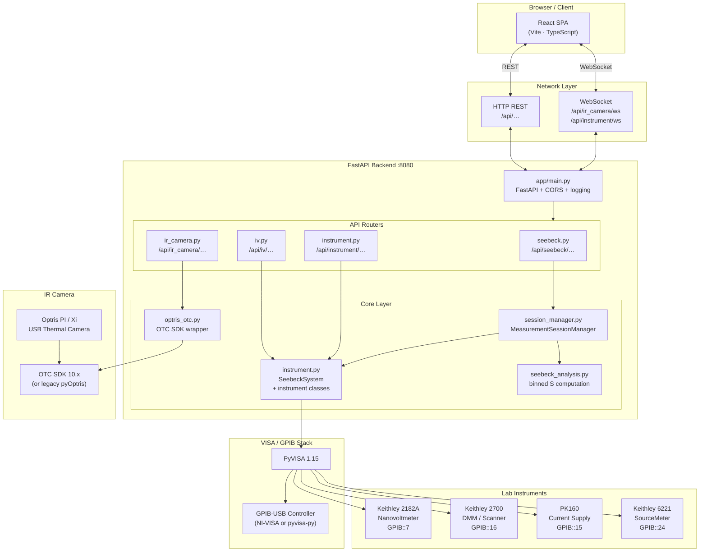

---

## 3. Backend Architecture

### 3.1 Module Structure

```
backend/
├── app/
│   ├── main.py                   # FastAPI app factory, CORS, middleware, router registration
│   ├── __init__.py
│   ├── routers/
│   │   ├── seebeck.py            # POST /seebeck/start|stop  GET /seebeck/status|data
│   │   ├── iv.py                 # POST /iv/run
│   │   ├── instrument.py         # GET /instrument/discover  WS /instrument/ws
│   │   └── ir_camera.py          # WS /api/ir_camera/ws  POST /api/ir_camera/nuc
│   ├── core/
│   │   ├── instrument.py         # Instrument driver classes + SeebeckSystem façade
│   │   ├── session_manager.py    # Threaded Seebeck session state machine
│   │   ├── seebeck_analysis.py   # Binned S linear-fit analysis
│   │   └── optris_otc.py         # Optris OTC SDK 10.x integration
│   └── models/
│       ├── measurement.py        # Pydantic models: MeasurementConfig, MeasurementResponse, …
│       └── __init__.py
├── requirements.txt
├── find_instruments.py           # Utility: auto-discover GPIB addresses
├── check_instruments.py          # Utility: check VISA lock state
└── fix_instrument_locks.py       # Utility: release stale VISA locks
```

### 3.2 Class Diagram

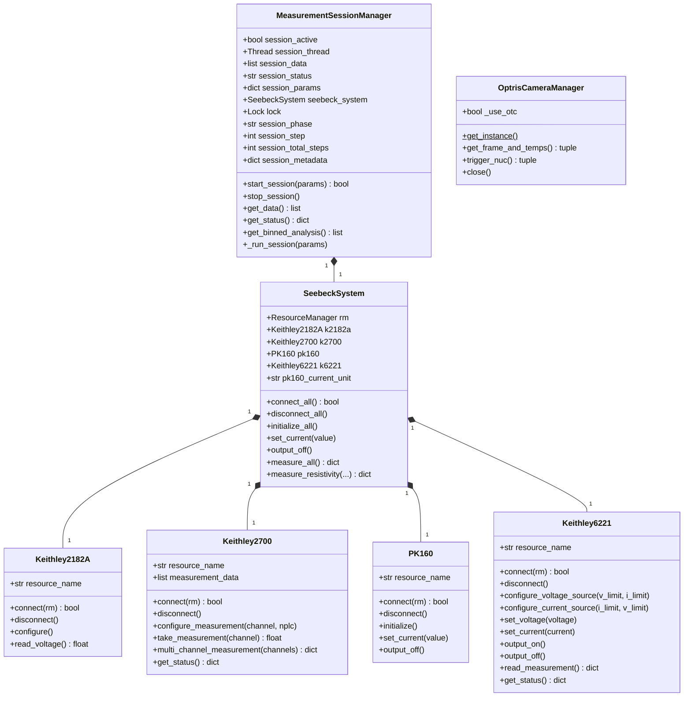

### 3.3 Application Startup & Routing

`app/main.py` creates the FastAPI app and registers four routers:

| Router file | URL prefix | Transport | Purpose |
|---|---|---|---|
| `instrument.py` | `/api/instrument` | HTTP + WebSocket | GPIB discovery, 2700 single measure, WS broadcast |
| `seebeck.py` | `/api/seebeck` | HTTP | Start/stop/status/data for Seebeck sessions |
| `iv.py` | `/api/iv` | HTTP | Single-shot IV sweep |
| `ir_camera.py` | *(no prefix — paths embedded)* | HTTP + WebSocket | Thermal frame stream, NUC control |

CORS is configured to allow:
- `http://localhost:5173` (local dev)
- `https://seebeck-web.web.app` (Firebase production)
- Any `*.trycloudflare.com` tunnel
- Any other HTTP/HTTPS origin via regex (for Tailscale / remote access)

---

## 4. Frontend Architecture

### 4.1 Module Structure

```
frontend/
├── index.html
├── vite.config.ts
├── src/
│   ├── main.tsx                  # React root, renders <App />
│   ├── App.tsx                   # BrowserRouter, theme, AppBar, route table
│   ├── App.css / index.css
│   ├── components/
│   │   ├── NavigationTabs.tsx    # Tab bar  (Seebeck | I-V | Seebeck+Resistivity)
│   │   ├── SeebeckMeasurementPanel.tsx   # Route: /seebeck
│   │   ├── IVMeasurementPanel.tsx        # Route: /iv
│   │   ├── SeebeckResistivityPanel.tsx   # Route: /seebeck-resistivity
│   │   ├── MeasurementPanel.tsx          # Shared measurement UI primitives
│   │   └── MeasurementDiagramForm.tsx    # Sample dimension form
│   └── api/
│       ├── client.ts             # Axios instance (VITE_API_BASE_URL)
│       ├── config.ts             # Base URL helper
│       └── iv.ts                 # Typed IV API call wrappers
├── package.json
├── firebase.json / .firebaserc   # Firebase Hosting deployment config
└── .gitignore
```

### 4.2 Component Hierarchy

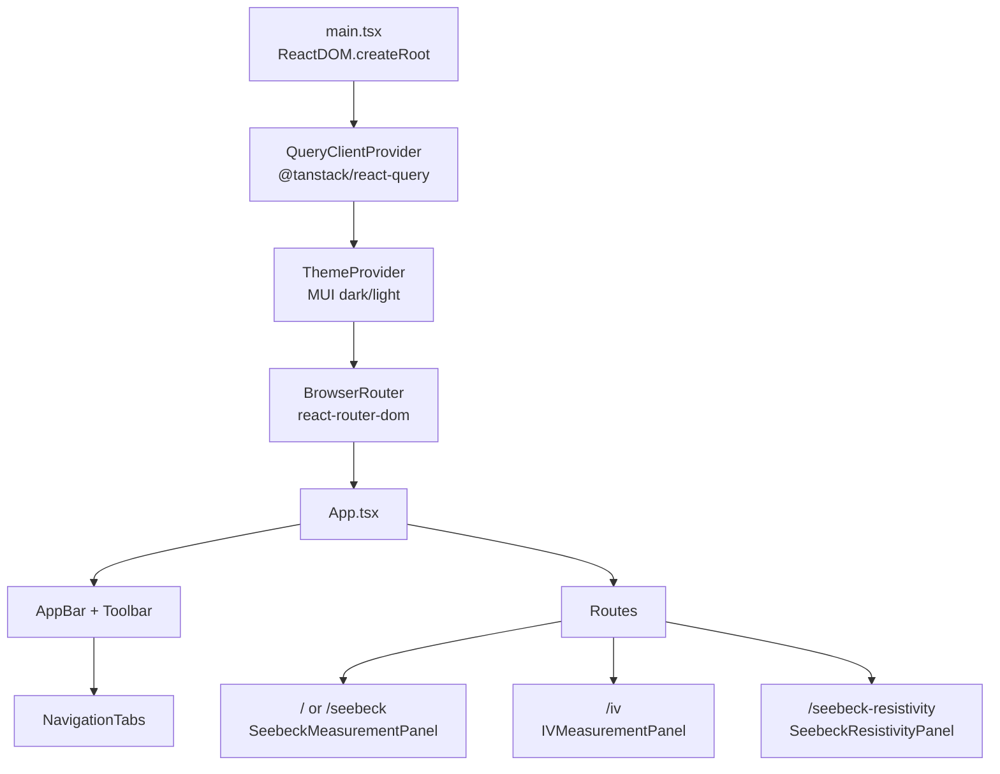

### 4.3 State Management & Data Fetching

- **@tanstack/react-query** manages server-state: polling `/seebeck/status` and `/seebeck/data` during an active Seebeck session (configurable refetch interval).
- **Axios** (`api/client.ts`) provides the HTTP transport layer; the base URL is injected via the `VITE_API_BASE_URL` environment variable.
- **React `useState` / `useEffect`** manage local UI state (form fields, unit selectors, chart data for IV).

### 4.4 Chart & Export Pipeline

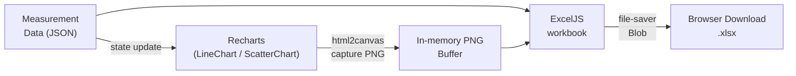

---

## 5. Hardware & Instrument Layer

### 5.1 Instrument Roles

| Instrument | GPIB Address (default) | Role in System |
|---|---|---|
| Keithley 2182A | `GPIB0::7::INSTR` | Nanovoltmeter — measures thermoelectric EMF (TEMF) in the Seebeck loop |
| Keithley 2700 | `GPIB0::16::INSTR` | DMM/Scanner with thermocouple card — reads T₁ and T₂ via K-type TCs on channels 102 and 104 |
| PK160 | `GPIB0::15::INSTR` | Programmable current supply — heats the sample by ramping current through the heater element |
| Keithley 6221 | `GPIB0::24::INSTR` | SourceMeter — sources voltage (or current) and measures I for I-V sweeps and resistivity |

### 5.2 Instrument Communication Sequence

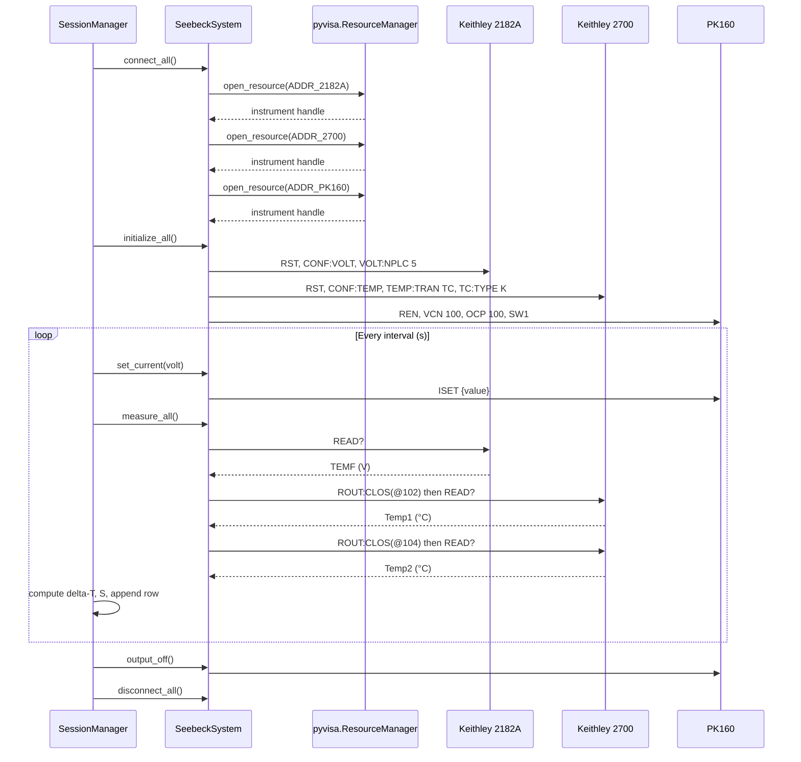

### 5.3 I-V Sweep Sequence (Keithley 6221)

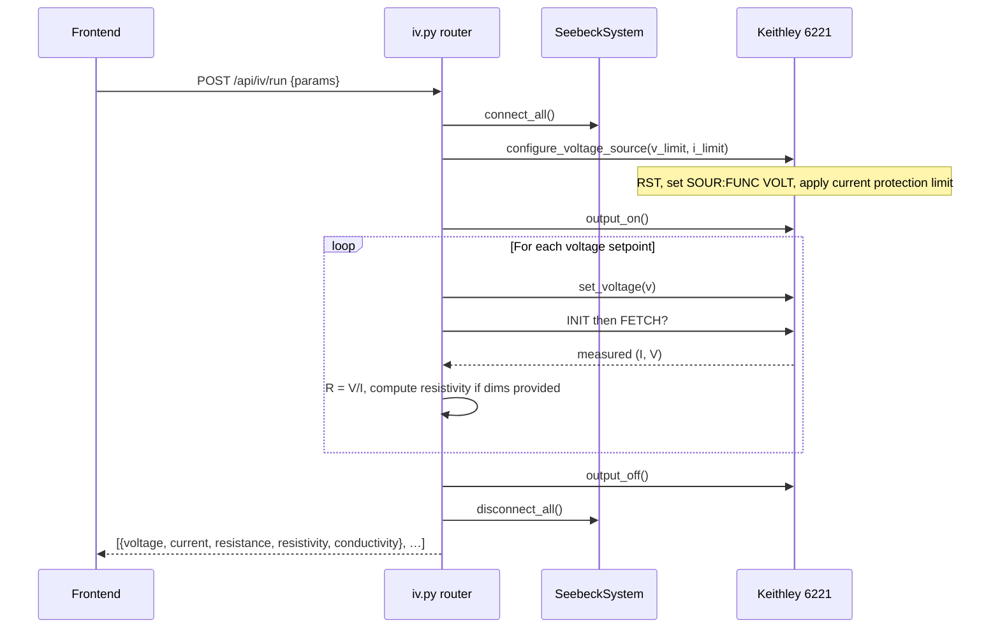

---

## 6. IR Camera Subsystem

### 6.1 Overview

The IR camera subsystem provides a real-time thermal video feed from an **Optris PI/Xi USB camera**. It supports two SDK backends selected automatically at startup:

| Backend | Condition | Capabilities |
|---|---|---|
| **OTC SDK 10.x** (`optris_otc.py`) | `C:\Program Files\Optris\otcsdk` present | Full NUC (Non-Uniformity Correction), callback-based frame delivery |
| **Legacy pyOptris / IrDirectSDK** | OTC unavailable | Frame polling via `get_thermal_image()`; NUC not supported |

### 6.2 IR Camera Architecture

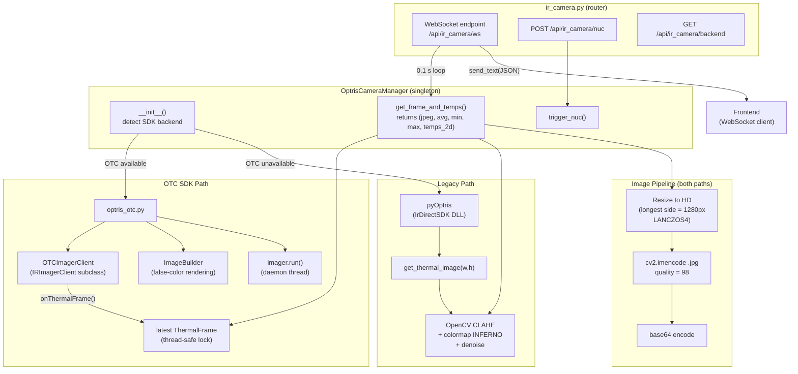

### 6.3 WebSocket Frame Format

Each WebSocket message is a JSON object:

```json
{
  "image": "<base64-encoded JPEG string>",
  "avg":   23.5,
  "min":   21.0,
  "max":   45.2,
  "temps": [[21.0, 21.1, ...], ...]
}
```

---

## 7. Data Flow Diagrams

### 7.1 Seebeck Measurement — End-to-End Flow

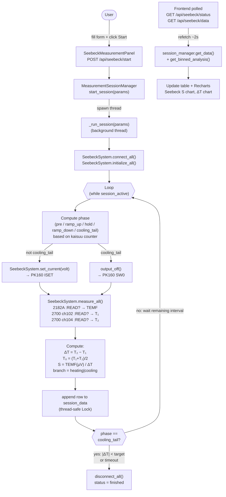

### 7.2 Seebeck Session State Machine

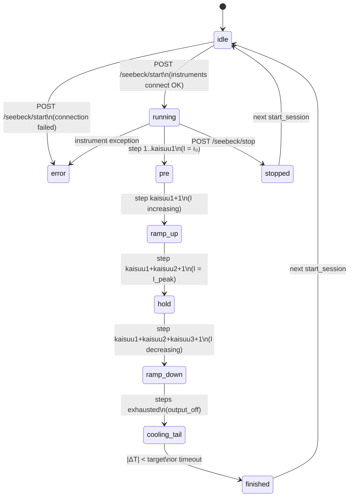

### 7.3 I-V Measurement — End-to-End Flow

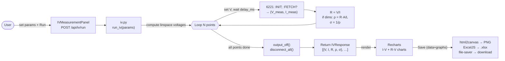

---

## 8. API Reference

Base URL: `http://<host>:8080/api`

### 8.1 Seebeck Endpoints

| Method | Path | Body / Response | Description |
|---|---|---|---|
| `POST` | `/seebeck/start` | `MeasurementParams` → `{status}` | Start a Seebeck session in a background thread |
| `POST` | `/seebeck/stop` | — → `{status}` | Gracefully stop the running session |
| `GET` | `/seebeck/status` | — → `SessionStatus` | Session state, phase, step, ETA, metadata |
| `GET` | `/seebeck/data` | — → `{data, analysis, metadata}` | All measurement rows + binned S analysis |
| `POST` | `/seebeck/resistivity` | `ResistivityParams` → resistivity dict | One-shot resistivity measurement via 6221 |

#### MeasurementParams Schema

```json
{
  "interval":       2,
  "pre_time":       60,
  "start_volt":     0.0,
  "stop_volt":      200.0,
  "inc_rate":       2.0,
  "dec_rate":       2.0,
  "hold_time":      300,
  "sample_id":      "S-001",
  "operator":       "Hamasaki",
  "notes":          "Optional notes",
  "target_T0_K":    300.0,
  "probe_arrangement": "4-probe",
  "cooling_target_delta_t": 5.0,
  "cooling_timeout_s": 600,
  "stabilization_delay_s": 0.0,
  "pk160_current_unit": "mA"
}
```

> **Note on naming:** `start_volt` / `stop_volt` / `inc_rate` / `dec_rate` are legacy parameter names. Their values represent **current setpoints (mA or A)** and ramp **rates (mA/s or A/s)** sent to the PK160, not voltages.

### 8.2 I-V Endpoints

| Method | Path | Body / Response | Description |
|---|---|---|---|
| `POST` | `/iv/run` | `IVParams` → `IVResponse` | Run a linear V-sweep on the Keithley 6221 |

#### IVParams Schema

```json
{
  "start_voltage":  -1.0,
  "stop_voltage":    1.0,
  "points":          101,
  "delay_ms":        50.0,
  "current_limit":   0.1,
  "voltage_limit":  21.0,
  "length":          0.005,
  "width":           0.002,
  "thickness":       0.001
}
```

### 8.3 Instrument Endpoints

| Method | Path | Response | Description |
|---|---|---|---|
| `GET` | `/instrument/discover` | instrument list + recommended addresses | Queries all GPIB resources via `*IDN?` |
| `POST` | `/instrument/connect` | `InstrumentStatus` | Connect to Keithley 2700 |
| `POST` | `/instrument/disconnect` | message | Disconnect from 2700 |
| `POST` | `/instrument/configure` | `MeasurementResponse` | Configure 2700 channel / NPLC |
| `POST` | `/instrument/measure` | `MeasurementResponse` | Take one 2700 measurement; broadcasts over WS |
| `GET` | `/instrument/measurements` | `MeasurementHistory` | All buffered 2700 readings |
| `DELETE` | `/instrument/measurements` | message | Clear measurement buffer |
| `GET` | `/instrument/status` | `InstrumentStatus` | 2700 connection status |
| `WS` | `/instrument/ws` | JSON broadcast | Real-time measurement push |

### 8.4 IR Camera Endpoints

| Method | Path | Description |
|---|---|---|
| `GET` | `/api/ir_camera/backend` | Report active SDK (`otc` or `legacy`) |
| `POST` | `/api/ir_camera/nuc` | Trigger NUC on camera |
| `WS` | `/api/ir_camera/ws` | Stream `{image, avg, min, max, temps}` at ~10 FPS |

---

## 9. Key Dependencies

### 9.1 Backend

| Package | Version | Purpose |
|---|---|---|
| `fastapi` | 0.115 | Web framework, async routes, OpenAPI docs at `/docs` |
| `uvicorn` | 0.34 | ASGI server |
| `pydantic` | 2.11 | Request/response validation with `field_validator` |
| `PyVISA` | 1.15 | GPIB instrument communication (wraps NI-VISA or pyvisa-py) |
| `numpy` | 2.3 | Array operations for IR frame processing |
| `opencv-python-headless` | 4.11 | Image processing: CLAHE, colormap, resize, JPEG encode |
| `pyOptris` | git@9cae1ce | Legacy Optris IrDirectSDK Python bindings |
| `websockets` | 15.0 | WebSocket support for IR camera stream |

### 9.2 Frontend

| Package | Version | Purpose |
|---|---|---|
| `react` | 18.2 | UI framework |
| `vite` | 5.1 | Build tool and dev server |
| `typescript` | 5.2 | Type safety |
| `@mui/material` | 7.1 | Component library (AppBar, Tabs, inputs) |
| `@tanstack/react-query` | 5.80 | Server-state polling and caching |
| `axios` | 1.9 | HTTP client |
| `recharts` | 2.15 | SVG charts (Seebeck S-T, I-V, R-V) |
| `exceljs` | 4.4 | Excel workbook generation in-browser |
| `html2canvas` | 1.4 | Screenshot chart DOM nodes to PNG |
| `file-saver` | 2.0 | Trigger browser file download |
| `react-router-dom` | 6.30 | Client-side routing |

---

## 10. Deployment

### 10.1 Local Development

```
PC (Windows, NI-VISA installed)
├── Terminal A: uvicorn backend on :8080
└── Terminal B: vite dev server on :5173
```

```bash
# Backend
cd backend
python -m venv venv && venv\Scripts\activate
pip install -r requirements.txt
python -m uvicorn app.main:app --reload --host 0.0.0.0 --port 8080

# Frontend
cd frontend
echo VITE_API_BASE_URL=http://localhost:8080/api > .env
npm install && npm run dev
```

### 10.2 Production / Remote Access

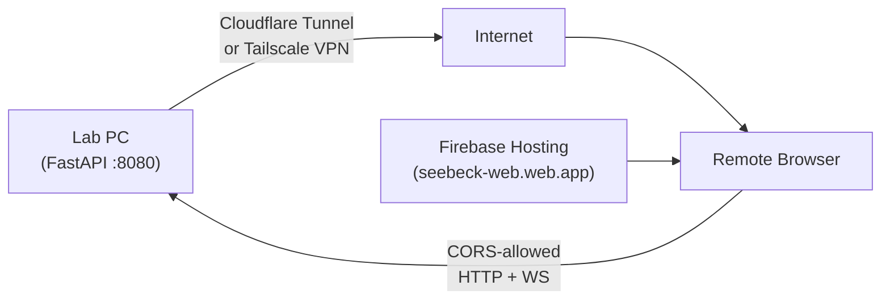

- The **React SPA is hosted on Firebase** (`firebase deploy`); it is a static build.
- The **FastAPI backend remains on the lab PC** with instruments attached.
- Remote access is possible via **Cloudflare Tunnel** (any `*.trycloudflare.com` domain) or **Tailscale** (private VPN). Both are whitelisted in CORS.

### 10.3 Environment Variables

| Variable | Where | Default | Description |
|---|---|---|---|
| `VITE_API_BASE_URL` | `frontend/.env` | `http://localhost:8080/api` | Backend base URL used by the SPA |
| `OTC_SDK_DIR` | OS env / shell | `C:\Program Files\Optris\otcsdk` | Root directory of the Optris OTC SDK |

---

## 11. Design Decisions & Trade-offs

### 11.1 Threaded Seebeck Session vs. Async

The Seebeck measurement loop runs in a **`threading.Thread`** rather than an async coroutine. This is intentional: PyVISA's GPIB calls are synchronous and blocking; running them in a thread avoids blocking the FastAPI event loop while preserving simple sequential instrument-control code. A `threading.Lock` serializes writes to `session_data`.

### 11.2 Staggered vs. Simultaneous Acquisition

The current acquisition order is **V → T₁ → T₂** (sequential). Per NIST recommendations for accurate Seebeck measurement, voltage and temperature should be acquired simultaneously. The 0.05 s inter-channel delay has been minimized but cannot be eliminated without hardware triggering (e.g., via a triggering card on the 2700 or an external trigger bus). This introduces a small staggered-acquisition error at high ramp rates.

### 11.3 IV Sweep: Blocking HTTP Request

The `/iv/run` endpoint blocks until the entire sweep completes. For typical sweep sizes (≤200 points, 50 ms delay) this takes ≤10 s and is acceptable. For longer sweeps, a session-based approach (like Seebeck) with polling would be preferable.

### 11.4 IR Camera: Singleton Pattern

`OptrisCameraManager` is a **singleton** (`get_instance()`) to ensure only one process owns the camera SDK handle at a time. The OTC SDK's FailSafeWatchdog requires the `onThermalFrame` callback to complete within 150 ms; the callback stores only a reference and returns immediately to avoid watchdog trips.

### 11.5 Parameter Naming Legacy

The Seebeck API parameters `start_volt`, `stop_volt`, `inc_rate`, `dec_rate` use "volt/rate" names inherited from an earlier UI design. In reality these are **current setpoints** (I₀ and I in mA or A) and ramp rates (mA/s or A/s) for the PK160 current supply. The unit is selected via `pk160_current_unit` (`"mA"` or `"A"`); when set to `"A"`, values are multiplied by 1000 before being sent to the supply's `ISET` command (which expects mA).

### 11.6 Resistivity Calculation

The 4-point (van der Pauw) probe arrangement is noted in metadata but the resistivity formula used is the simple **2-probe bar formula**:

```
ρ = R × (width × thickness) / length    [Ω·m]
```

Users selecting `4-probe` in the UI should be aware that the geometric correction factor is not applied automatically. A dedicated 4-probe mode with separate source/sense connections would require routing different 6221 terminals.
