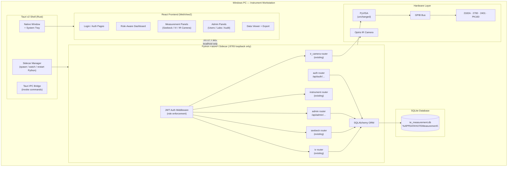
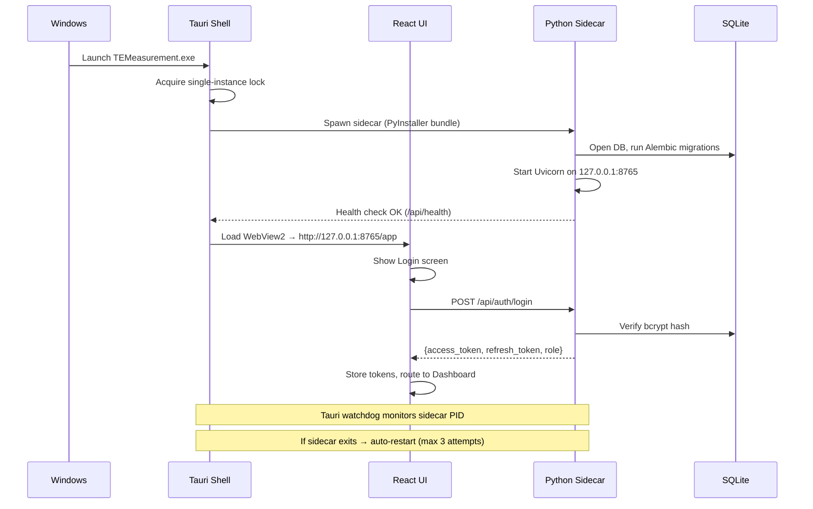
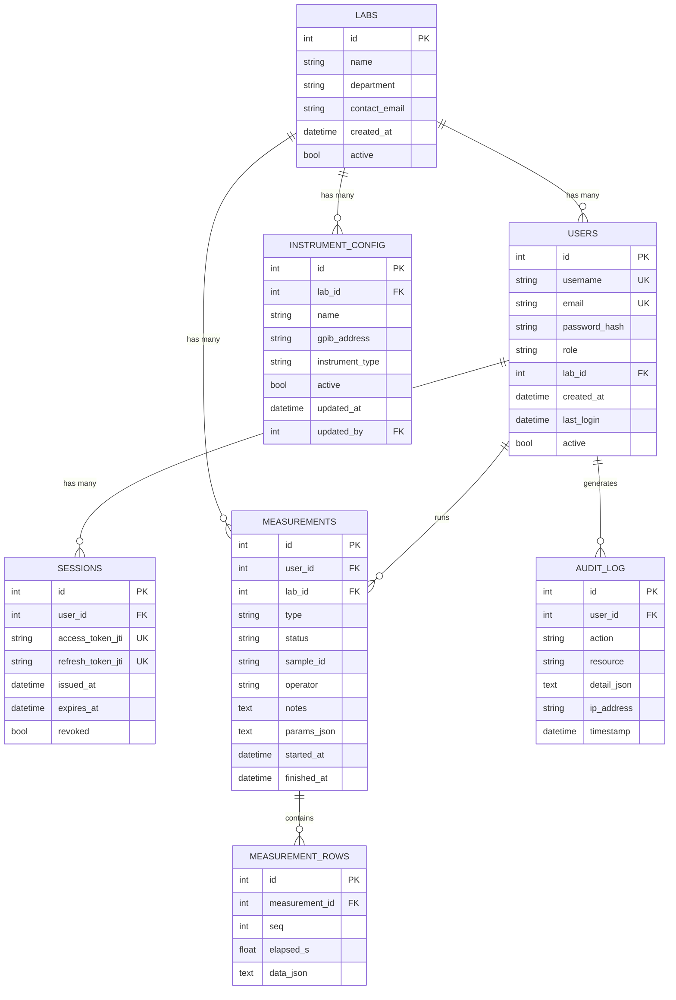
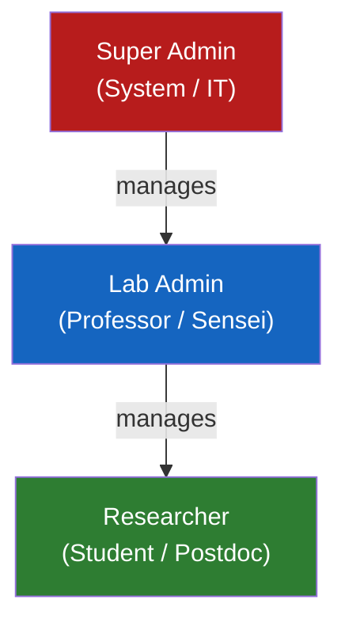
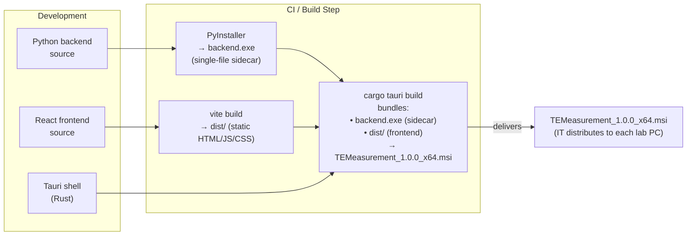

# Desktop Application — Design & Architecture Plan
## TE Measurement System — University-Wide Edition
**Ikeda-Hamasaki Laboratory**  
Version 1.0 — March 2026

---

## Table of Contents

1. [Executive Summary](#1-executive-summary)
2. [Technology Stack — Evaluation & Recommendation](#2-technology-stack--evaluation--recommendation)
3. [System Architecture](#3-system-architecture)
4. [Database Design](#4-database-design)
5. [Role & Permission Model](#5-role--permission-model)
6. [UI/UX Design](#6-uiux-design)
7. [Migration from Current Web App](#7-migration-from-current-web-app)
8. [Build, Packaging & Distribution](#8-build-packaging--distribution)
9. [Stability & Reliability Strategy](#9-stability--reliability-strategy)
10. [Implementation Roadmap](#10-implementation-roadmap)

---

## 1. Executive Summary

### The Problem
The current system is a **web application** that assumes the user is always on the same machine as the instruments. It has no user identity, no data history, no audit trail, and cannot distinguish between a visiting student, a professor, or a system administrator. Deploying it across multiple labs in a university means every lab has its own disconnected instance.

### The Goal
A **single-machine desktop application** that:
- Runs on the one PC physically wired to the GPIB instruments
- Is stable enough for unattended lab operation
- Stores all measurement data in a local database
- Enforces three-tier role access: Super Admin → Lab Admin → Researcher
- Has a clean, professional UI that guides users without overwhelming them

### The Recommendation — In One Line
> **Tauri v2 + React/TypeScript + Python FastAPI sidecar + SQLite**

This stack lets the team reuse ~80 % of the existing code, produces a native Windows `.exe` installer, consumes far less memory than Electron, and is crash-isolated by design.

---

## 2. Technology Stack — Evaluation & Recommendation

### 2.1 Framework Comparison

| Criterion | **Tauri v2** ✅ | Electron | PyQt6 | .NET WinUI 3 |
|---|---|---|---|---|
| Bundle size | ~8 MB | ~150 MB | ~30 MB | ~25 MB |
| Memory (idle) | ~40 MB | ~200 MB | ~60 MB | ~50 MB |
| Crash isolation | Excellent (Rust core) | Moderate | Moderate | Good |
| Reuse existing frontend | 100 % (React) | 100 % (React) | 0 % | 0 % |
| Reuse existing backend | 100 % (Python sidecar) | 100 % | 100 % (direct import) | 0 % |
| Windows installer | Built-in (NSIS / MSI) | electron-builder | PyInstaller | MSIX |
| Auto-update | Built-in | electron-updater | Manual | MSIX store |
| System tray | Built-in | Built-in | Built-in | Limited |
| UI quality ceiling | Very high (web tech) | Very high | High (Qt) | Very high |
| Learning curve (team) | Low (knows React/Python) | Low | Medium | High |
| License | MIT | MIT | LGPL | MIT |

**Tauri wins on every dimension that matters for this use case**: small installer for IT deployment, low memory footprint for a PC shared with instrument drivers, and zero rewrite cost for the frontend and backend.

### 2.2 Full Recommended Stack

```
┌─ Desktop Shell ──────────────────────────────────────────┐
│  Tauri v2  (Rust)                                        │
│  • Native window, title bar, system tray                 │
│  • Sidecar process manager — spawns Python backend       │
│  • IPC bridge (invoke commands to Rust layer)            │
│  • Built-in updater, single-instance lock, deep links    │
├─ Frontend ────────────────────────────────────────────────┤
│  React 18 + TypeScript + Vite                            │
│  MUI v7  (component library — already used)              │
│  @tanstack/react-query  (server state — already used)    │
│  react-router-dom v6  (routing — already used)           │
│  recharts  (charts — already used)                       │
│  exceljs + html2canvas  (export — already used)          │
│  zustand  (client auth state, lightweight)               │
├─ Backend Sidecar ─────────────────────────────────────────┤
│  Python FastAPI  (existing codebase — extended)          │
│  SQLAlchemy 2.x + Alembic  (ORM + migrations)           │
│  SQLite  (single-file DB, zero config)                   │
│  passlib[bcrypt]  (password hashing)                     │
│  python-jose  (JWT access + refresh tokens)              │
│  PyVISA  (GPIB — unchanged)                              │
│  Bundled via PyInstaller into a single .exe sidecar      │
└───────────────────────────────────────────────────────────┘
```

### 2.3 Why Not Electron?

Electron ships its own Chromium (~130 MB) and Node.js. A lab PC running NI-VISA drivers, instrument software, and an IR camera SDK is already memory-constrained. Tauri uses the OS's built-in WebView (Edge WebView2 on Windows 11, which is already installed), so the app shell is ~8 MB and uses ~40 MB RAM at idle.

### 2.4 Why SQLite Over PostgreSQL/MySQL?

Rule 2 states the app runs on **one machine**. A separate database server would be a single point of failure, require DBA knowledge, and add installation complexity for IT staff. SQLite:
- Is a single `.db` file in `%APPDATA%\TEMeasurement\`
- Survives power-loss (WAL journal mode)
- Supports up to ~100 concurrent connections (well above any lab scenario)
- Can be backed up by simply copying the file

---

## 3. System Architecture

### 3.1 High-Level Architecture



### 3.2 Process Model



### 3.3 Network Isolation

The Python server binds **exclusively to `127.0.0.1:8765`** — not `0.0.0.0`. This means:
- No external network access is possible
- No CORS configuration needed (same origin)
- The measurement data never leaves the machine without explicit export
- IT security teams have nothing to audit from a network perspective

---

## 4. Database Design

### 4.1 Entity Relationship Diagram



### 4.2 Schema Notes

**`users.role`** — stored as a string enum: `super_admin`, `lab_admin`, `researcher`

**`measurements.type`** — `seebeck` | `iv` | `seebeck_resistivity`

**`measurements.status`** — `running` | `finished` | `stopped` | `error`

**`measurement_rows.data_json`** — stores one time-series row as JSON (same structure as current `session_data` dict). This avoids schema changes when measurement columns evolve.

**`sessions` table** — tracks JWT JTI (JWT ID) so tokens can be explicitly revoked on logout. The `refresh_token_jti` enables token rotation.

**`audit_log`** — append-only. Every login, logout, measurement start/stop, user create/delete, and config change writes a row. Super Admins can view and export this log.

### 4.3 SQLAlchemy Models (Python)

```python
# Abbreviated — illustrative, not production-complete

class Lab(Base):
    __tablename__ = "labs"
    id = Column(Integer, primary_key=True)
    name = Column(String(100), nullable=False)
    department = Column(String(100))
    users = relationship("User", back_populates="lab")

class User(Base):
    __tablename__ = "users"
    id = Column(Integer, primary_key=True)
    username = Column(String(50), unique=True, nullable=False)
    email = Column(String(120), unique=True, nullable=False)
    password_hash = Column(String(200), nullable=False)
    role = Column(Enum("super_admin", "lab_admin", "researcher"), nullable=False)
    lab_id = Column(Integer, ForeignKey("labs.id"), nullable=True)
    active = Column(Boolean, default=True)
    lab = relationship("Lab", back_populates="users")

class Measurement(Base):
    __tablename__ = "measurements"
    id = Column(Integer, primary_key=True)
    user_id = Column(Integer, ForeignKey("users.id"))
    lab_id = Column(Integer, ForeignKey("labs.id"))
    type = Column(String(30))           # seebeck | iv | seebeck_resistivity
    status = Column(String(20))         # running | finished | stopped | error
    sample_id = Column(String(100))
    params_json = Column(Text)
    started_at = Column(DateTime, default=func.now())
    finished_at = Column(DateTime, nullable=True)
    rows = relationship("MeasurementRow", back_populates="measurement")

class AuditLog(Base):
    __tablename__ = "audit_log"
    id = Column(Integer, primary_key=True)
    user_id = Column(Integer, ForeignKey("users.id"), nullable=True)
    action = Column(String(50))         # LOGIN | LOGOUT | MEAS_START | USER_CREATE | …
    resource = Column(String(50))
    detail_json = Column(Text)
    timestamp = Column(DateTime, default=func.now())
```

---

## 5. Role & Permission Model

### 5.1 Role Hierarchy



### 5.2 Permission Matrix

| Capability | Super Admin | Lab Admin | Researcher |
|---|:---:|:---:|:---:|
| **Auth** | | | |
| Login / logout | ✅ | ✅ | ✅ |
| Change own password | ✅ | ✅ | ✅ |
| **User Management** | | | |
| Create / deactivate any user | ✅ | — | — |
| Create / deactivate researcher (own lab) | — | ✅ | — |
| View all users | ✅ | — | — |
| View users in own lab | — | ✅ | — |
| Reset another user's password | ✅ | ✅ (own lab only) | — |
| **Lab Management** | | | |
| Create / edit / delete labs | ✅ | — | — |
| Edit own lab profile | — | ✅ | — |
| **Instrument Config** | | | |
| Edit GPIB addresses | ✅ | — | — |
| Run instrument discovery | ✅ | ✅ | — |
| View instrument status | ✅ | ✅ | ✅ |
| **Measurements** | | | |
| Start / stop measurement | ✅ | ✅ | ✅ |
| View own measurements | ✅ | ✅ | ✅ |
| View all measurements (own lab) | ✅ | ✅ | — |
| View all measurements (all labs) | ✅ | — | — |
| Delete measurements | ✅ | ✅ (own lab) | — |
| **Export** | | | |
| Export own data (Excel/CSV) | ✅ | ✅ | ✅ |
| Export lab data | ✅ | ✅ | — |
| Export all data | ✅ | — | — |
| **Audit Log** | | | |
| View full audit log | ✅ | — | — |
| View own lab audit log | — | ✅ | — |
| **System** | | | |
| View system health | ✅ | — | — |
| Backup / restore database | ✅ | — | — |
| View / change app settings | ✅ | — | — |

### 5.3 JWT Token Design

```
Access Token  — short-lived (15 min), signed HS256
  payload: { sub: user_id, role: "researcher", lab_id: 3,
             jti: "uuid4", exp: ..., iat: ... }

Refresh Token — longer-lived (8 hours = one lab session), stored in DB sessions table
  payload: { sub: user_id, jti: "uuid4", exp: ... }
```

- On every API request, FastAPI middleware validates the access token and injects `current_user` (id, role, lab_id) into the route handler.
- Routes use **FastAPI dependencies** (`Depends(require_role("lab_admin"))`) — clean, testable, no scattered role checks.
- Refresh is automatic: the frontend silently calls `/api/auth/refresh` when the access token nears expiry.
- Logout revokes both JTIs in the `sessions` table — no token reuse is possible.

### 5.4 FastAPI Auth Dependency Pattern

```python
# Illustrative — shows clean dependency injection pattern

from fastapi import Depends, HTTPException, status
from enum import Enum

class Role(str, Enum):
    super_admin = "super_admin"
    lab_admin = "lab_admin"
    researcher = "researcher"

ROLE_RANK = {Role.researcher: 0, Role.lab_admin: 1, Role.super_admin: 2}

def require_role(minimum_role: Role):
    def checker(current_user: User = Depends(get_current_user)):
        if ROLE_RANK[current_user.role] < ROLE_RANK[minimum_role]:
            raise HTTPException(status_code=403, detail="Insufficient privileges")
        return current_user
    return checker

# Usage in a route:
@router.get("/admin/users")
def list_users(user: User = Depends(require_role(Role.lab_admin)), db: Session = Depends(get_db)):
    ...
```

---

## 6. UI/UX Design

### 6.1 Design Principles

| Principle | Implementation |
|---|---|
| **One task per screen** | Each route shows one primary action area. No tabbed mega-panels. |
| **Role-aware navigation** | The sidebar only shows items the logged-in role can access. |
| **Status always visible** | Instrument connection status and active session phase shown in the status bar (always at bottom). |
| **Destructive actions are protected** | Delete / stop operations require a confirmation dialog. |
| **Dense but not cluttered** | MUI `size="small"` inputs in forms; data tables use compact row height. |
| **Dark mode** | System-preference aware; user can override (already implemented). |

### 6.2 Screen Map

```mermaid
flowchart TD
    LOGIN["Login Screen\n(username + password)"]

    LOGIN -->|"super_admin"| SA_DASH
    LOGIN -->|"lab_admin"| LA_DASH
    LOGIN -->|"researcher"| RES_DASH

    subgraph SA["Super Admin Views"]
        SA_DASH["Dashboard\n(system health, active sessions, quick stats)"]
        SA_USERS["User Management\n(create, edit, deactivate users)"]
        SA_LABS["Lab Management\n(create, edit labs)"]
        SA_INST["Instrument Config\n(GPIB addresses, discovery)"]
        SA_AUDIT["Audit Log\n(filterable, exportable)"]
        SA_BACKUP["DB Backup / Restore"]
        SA_MEAS["All Measurements\n(cross-lab view)"]
    end

    subgraph LA["Lab Admin Views"]
        LA_DASH["Dashboard\n(lab overview, recent measurements)"]
        LA_USERS["Researcher Management\n(create / deactivate in own lab)"]
        LA_MEAS["Lab Measurements\n(all researchers in lab)"]
        LA_EXPORT["Batch Export\n(lab data → Excel/CSV)"]
        SHARED_MEAS["Measurement Pages\n(run Seebeck / IV / IR)"]
    end

    subgraph RES["Researcher Views"]
        RES_DASH["Dashboard\n(my recent measurements)"]
        RES_MEAS["My Measurements\n(history + data viewer)"]
        SHARED_MEAS2["Measurement Pages\n(run Seebeck / IV / IR)"]
    end

    SA_DASH --> SA_USERS & SA_LABS & SA_INST & SA_AUDIT & SA_BACKUP & SA_MEAS
    LA_DASH --> LA_USERS & LA_MEAS & LA_EXPORT & SHARED_MEAS
    RES_DASH --> RES_MEAS & SHARED_MEAS2
```



### 6.3 Layout Structure

```
┌──────────────────────────────────────────────────────────┐
│  TE Measurements           [Lab: Ikeda-Hamasaki] [User▼] │  ← AppBar (48px)
├────────────────┬─────────────────────────────────────────┤
│                │                                          │
│  Dashboard     │   Main Content Area                      │
│  ─────────     │   (route-driven, single focused panel)   │
│  Seebeck       │                                          │
│  I-V           │                                          │
│  IR Camera     │                                          │
│  ─────────     │                                          │
│  My Data       │                                          │
│  ─────────     │                                          │
│  [admin only]  │                                          │
│  Users         │                                          │
│  Labs          │                                          │
│  Instruments   │                                          │
│  Audit Log     │                                          │
│                │                                          │
├────────────────┴─────────────────────────────────────────┤
│  ● 2182A  ● 2700  ● 2401  ● PK160   Session: idle        │  ← Status bar (32px)
└──────────────────────────────────────────────────────────┘
```

### 6.4 Key Screens

**Login Screen**
- Centered card, app logo, username + password fields, Sign In button
- No registration link (accounts are admin-created)
- Clear error messages (wrong password vs. account deactivated)

**Researcher Dashboard**
- "Start New Measurement" — large primary call-to-action card
- "Recent Measurements" — last 5 rows with status chips and quick-view links
- No clutter: two cards, that's it

**Seebeck / IV Measurement Panels**
- Left column: parameter form (compact, grouped: Timing / Current Profile / Sample Info)
- Right column: live chart(s) + data table (tabs: Chart / Table)
- Bottom: Start / Stop button, progress bar, phase indicator
- Export button only appears after session finishes

**Data Viewer (My Measurements)**
- Table with columns: Date, Type, Sample ID, Status, Duration, Actions (View / Export / Delete)
- Clicking View opens a side drawer with full chart + data table — no page navigation
- Filters: date range, measurement type, status

**Admin — User Management**
- Table: Username, Email, Role, Lab, Last Login, Active (toggle)
- "+ Add User" button opens a dialog (not a new page)

---

## 7. Migration from Current Web App

### 7.1 What Carries Over Unchanged

| Component | Status |
|---|---|
| `backend/app/routers/seebeck.py` | Kept as-is |
| `backend/app/routers/iv.py` | Kept as-is |
| `backend/app/routers/ir_camera.py` | Kept as-is |
| `backend/app/core/instrument.py` | Kept as-is |
| `backend/app/core/session_manager.py` | Kept as-is |
| `backend/app/core/seebeck_analysis.py` | Kept as-is |
| `backend/app/core/optris_otc.py` | Kept as-is |
| All frontend measurement panels | Kept as-is (React components) |
| `recharts` charts + export pipeline | Kept as-is |

### 7.2 What Gets Added to the Backend

```
backend/app/
├── routers/
│   ├── auth.py          ← NEW: /api/auth/login, /logout, /refresh, /me
│   └── admin.py         ← NEW: /api/admin/users, /labs, /audit, /backup
├── core/
│   ├── database.py      ← NEW: SQLAlchemy engine + session factory
│   ├── security.py      ← NEW: JWT creation/validation, bcrypt helpers
│   └── audit.py         ← NEW: write_audit_log() utility
├── models/
│   ├── db_models.py     ← NEW: SQLAlchemy ORM models
│   └── schemas.py       ← NEW: Pydantic request/response schemas
└── middleware/
    └── auth_middleware.py  ← NEW: JWT validation, role injection
```

All **existing routers get one change**: add `current_user: User = Depends(get_current_user)` to each route handler. This single dependency injects the authenticated user and records measurements against their `user_id` and `lab_id`.

### 7.3 What Gets Added to the Frontend

```
frontend/src/
├── auth/
│   ├── AuthContext.tsx       ← NEW: global auth state (zustand store)
│   ├── LoginPage.tsx         ← NEW
│   └── ProtectedRoute.tsx    ← NEW: redirect to login if unauthenticated
├── components/
│   ├── SideNav.tsx           ← NEW: role-aware sidebar navigation
│   ├── StatusBar.tsx         ← NEW: instrument connection status footer
│   └── UserMenu.tsx          ← NEW: avatar dropdown (profile, logout)
├── pages/
│   ├── Dashboard.tsx         ← NEW: role-aware home page
│   ├── MyMeasurements.tsx    ← NEW: data viewer
│   ├── admin/
│   │   ├── UserManagement.tsx    ← NEW
│   │   ├── LabManagement.tsx     ← NEW
│   │   ├── InstrumentConfig.tsx  ← NEW
│   │   └── AuditLog.tsx          ← NEW
│   └── ...existing panels...    ← Kept, add auth headers to API calls
└── api/
    ├── auth.ts               ← NEW: login/logout/refresh wrappers
    ├── admin.ts              ← NEW: user/lab CRUD wrappers
    └── client.ts             ← MODIFIED: attach Bearer token to all requests
```

The Axios `client.ts` gets a **request interceptor** that attaches `Authorization: Bearer <token>` to every request, and a **response interceptor** that silently refreshes the token on 401 and retries. All existing API calls automatically become authenticated with this single change.

---

## 8. Build, Packaging & Distribution

### 8.1 Build Pipeline



### 8.2 What the Installer Does

1. Installs `TEMeasurement.exe` (Tauri shell, ~8 MB)
2. Installs `backend.exe` (PyInstaller sidecar, ~60 MB including Python runtime, PyVISA, FastAPI, etc.)
3. Creates `%APPDATA%\TEMeasurement\` for the SQLite database
4. Creates a Desktop shortcut and Start Menu entry
5. Registers for Windows auto-update checks

### 8.3 First-Run Setup

On first launch, the app detects an empty database and runs:
1. Alembic migrations (creates all tables)
2. Seeds a default **super_admin** account with a one-time password printed to a local setup log
3. Shows a "First Run" wizard prompting the super admin to change the password and create the first lab

### 8.4 IT Requirements Per Lab PC

| Requirement | Details |
|---|---|
| OS | Windows 10 22H2+ or Windows 11 |
| Edge WebView2 | Pre-installed on Win11; MSI ships a bootstrapper for Win10 |
| NI-VISA | Must be installed separately (as today) |
| Optris SDK | Must be installed separately (as today) |
| .NET runtime | Not required (Tauri uses WebView2, not .NET) |
| GPIB drivers | As today (NI-488.2) |
| RAM | 4 GB minimum, 8 GB recommended |
| Disk | ~500 MB for app + DB growth over years |

---

## 9. Stability & Reliability Strategy

Addressing Rule 1 ("it should not crash") with specific architectural decisions:

### 9.1 Process Isolation

The Tauri shell (Rust) and the Python sidecar are **separate OS processes**. If the Python backend crashes due to a GPIB instrument error or an unhandled exception:
- The Tauri shell remains alive — the UI stays open
- Tauri's sidecar watchdog detects the dead process (PID no longer alive)
- It automatically restarts the sidecar after a 2-second delay
- The frontend shows a toast: "Backend restarting — please wait"
- After restart, the frontend re-authenticates silently (refresh token is valid)

### 9.2 Database Safety

- SQLite WAL (Write-Ahead Log) mode is enabled at startup — survives hard power-off
- All writes use SQLAlchemy sessions with explicit `commit()` / `rollback()`
- Measurement rows are written **incrementally** per interval step, not only at session end — data is never lost if the app crashes mid-measurement
- Daily auto-backup copies `te_measurement.db` to `%APPDATA%\TEMeasurement\backups\` (last 7 days kept)

### 9.3 Instrument Error Containment

- All instrument operations remain inside `try/finally` blocks (as today)
- GPIB errors are caught per-route and return HTTP 500 with a descriptive message — they do not propagate to crash the process
- The `MeasurementSessionManager` thread has a top-level `except Exception` that sets `status = "error: ..."` and calls `disconnect_all()`, so instruments are always returned to a safe state

### 9.4 Frontend Resilience

- React error boundaries wrap each major panel — a rendering crash in the IV chart does not blank the entire app
- `@tanstack/react-query` retry logic handles transient network errors (backend still restarting)
- The status bar's instrument connection indicators update every 5 seconds independently of measurement state

### 9.5 Single-Instance Enforcement

Tauri's built-in single-instance plugin ensures that if a user double-clicks the icon while the app is already open, the existing window is brought to focus rather than launching a second instance (which could corrupt the VISA session).

---

## 10. Implementation Roadmap

### Phase 1 — Foundation (4–6 weeks)

| Task | Effort |
|---|---|
| Set up Tauri v2 project, integrate existing React frontend as WebView | 1 week |
| PyInstaller bundle of existing backend (confirm GPIB and IR camera work inside bundle) | 3–4 days |
| Tauri sidecar integration + health-check loop + auto-restart watchdog | 3 days |
| SQLAlchemy models + Alembic migration setup | 2 days |
| Auth router (login, logout, refresh, JWT, bcrypt) | 3 days |
| FastAPI auth middleware + role dependency injection | 2 days |
| Frontend: Login page, AuthContext, Axios interceptors, ProtectedRoute | 3 days |
| First-run wizard + default super_admin seeding | 2 days |

**Deliverable:** App launches, instruments work, login enforced. All existing measurement functionality works behind auth.

### Phase 2 — Role Management & Data Persistence (3–4 weeks)

| Task | Effort |
|---|---|
| Admin router: user CRUD, lab CRUD | 3 days |
| Frontend: User Management, Lab Management pages | 4 days |
| Measurement persistence (write to DB on start/stop, rows incremental) | 3 days |
| Frontend: My Measurements data viewer with side drawer | 3 days |
| Audit log: write events, Admin view | 3 days |
| Role-aware sidebar navigation + dashboard pages per role | 4 days |

**Deliverable:** Full three-tier role system, all measurements saved to DB, audit trail.

### Phase 3 — Polish & Production Hardening (2–3 weeks)

| Task | Effort |
|---|---|
| Status bar (live instrument connection indicators) | 2 days |
| React error boundaries on all panels | 1 day |
| DB auto-backup (daily, 7-day retention) | 1 day |
| Batch export: lab admin exports all data for a date range | 2 days |
| Instrument Config page (GPIB address management in DB) | 2 days |
| System tray icon (minimize to tray, quick-access menu) | 1 day |
| MSI installer + Edge WebView2 bootstrapper | 2 days |
| End-to-end testing on target lab PC | 3 days |

**Deliverable:** Production-ready installer deployable by IT to any lab PC.

---

## Summary — One-Page Stack Reference

```
Application type  : Native desktop (Tauri v2)  — not Electron, not a web app
OS target         : Windows 10/11 (single machine per lab)
Shell             : Rust (Tauri) — window, tray, sidecar management, auto-update
Frontend          : React 18 + TypeScript + MUI v7 + Vite  (reuse existing)
Backend           : Python FastAPI  (reuse existing, add auth + DB layers)
Database          : SQLite (WAL mode)  via SQLAlchemy 2 + Alembic
Auth              : bcrypt passwords + JWT (HS256) access/refresh tokens
Roles             : super_admin  >  lab_admin  >  researcher
Installer         : MSI (via cargo tauri build)  ~70 MB total
Sidecar bundle    : PyInstaller single-file  ~60 MB
Frontend bundle   : Vite dist  ~3 MB
Code reuse        : ~75 % of existing backend unchanged, ~60 % of frontend unchanged
```
