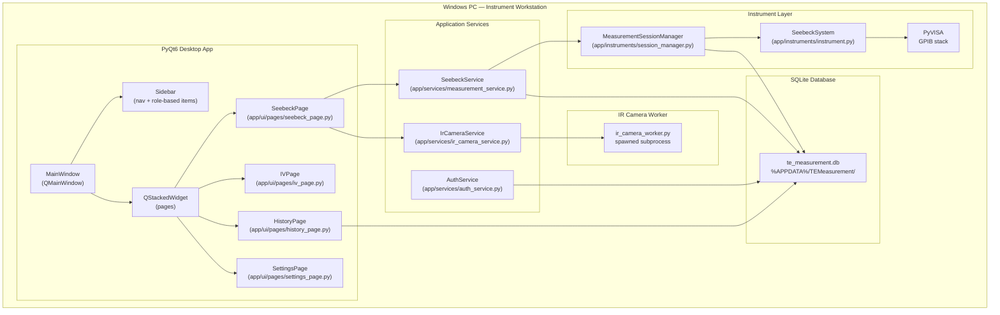
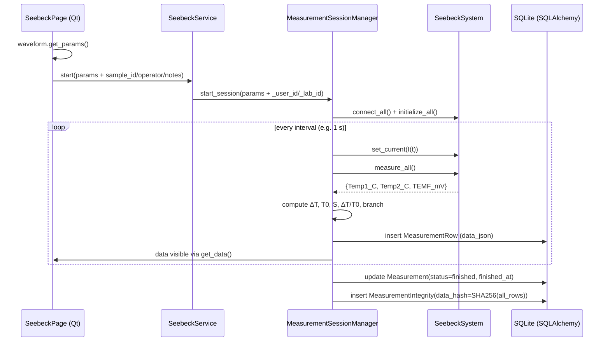
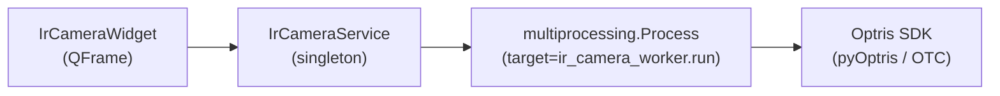

# Desktop Application Architecture
## TE Measurement System (PyQt6 Desktop)
**Ikeda-Hamasaki Laboratory**  
Version 1.0 — March 2026

---

## Table of Contents

1. [System Overview](#1-system-overview)
2. [High-Level Architecture](#2-high-level-architecture)
3. [Process & Thread Model](#3-process--thread-model)
4. [Desktop UI Architecture](#4-desktop-ui-architecture)
5. [Measurement Pipeline (Seebeck)](#5-measurement-pipeline-seebeck)
6. [IR Camera Subsystem](#6-ir-camera-subsystem)
7. [Database & Integrity Model](#7-database--integrity-model)
8. [History & Data Access](#8-history--data-access)
9. [Timing & 1-second Operation](#9-timing--1-second-operation)
10. [Roles & Permissions](#10-roles--permissions)
11. [Key Modules & Dependencies](#11-key-modules--dependencies)

---

## 1. System Overview

The **desktop_qt** application is a **single-machine, role-aware desktop client** for thermoelectric (TE) measurements. It is designed for the laboratory PC that is physically connected to:

- Keithley GPIB instruments (2182A, 2700, PK160, optionally 6221)
- An Optris IR camera (PI / Xi series) via USB (IrDirectSDK or OTC SDK)

The desktop app provides:

- A **Seebeck measurement workflow** with a visual current waveform editor and live plots
- An **I–V sweep workflow** (via `iv_page.py`)
- An **IR camera live-view** widget (optional, synchronized via metadata)
- A **Measurement History** view with immutable storage and integrity hashes
- A **user login system** with roles (`super_admin`, `lab_admin`, `researcher`)

Unlike the web app, the desktop app:

- Runs entirely on the measurement PC (no external network exposure)
- Directly uses **PyQt6** for the UI instead of running in a browser
- Shares the same **SQLAlchemy models** and schema as the backend sidecar

---

## 2. High-Level Architecture



Key points:

- The **main process** hosts all Qt windows/widgets and the Seebeck/IV logic.
- The **IR camera SDK** is isolated in a **spawned subprocess** to protect the main process from C-level crashes.
- All persistent state (users, labs, measurements, integrity hashes) lives in a single **SQLite** DB.

---

## 3. Process & Thread Model

### 3.1 Processes

- **Main PyQt6 process**
  - Runs `desktop_qt/main.py` → `LoginWindow` → `MainWindow`.
  - Owns the GPIB/Seebeck measurement threads.
  - Manages the IR camera *service stub* (`IrCameraService`), but **does not** load Optris DLLs directly.

- **IR worker subprocess (`ir_camera_worker.py`)**
  - Spawned by `IrCameraService` via `multiprocessing.Process` (`spawn` start method on Windows).
  - Calls Optris SDK functions (OTC SDK or legacy IrDirectSDK via `pyOptris`).
  - Pushes frames back through a `multiprocessing.Queue` to the main process.
  - If the SDK aborts or segfaults, only this subprocess dies; the Qt UI continues running.

### 3.2 Threads

- **MeasurementSessionManager.session_thread**
  - Background Python thread that runs the Seebeck state machine in `_run_session()`.
  - Ticks every `interval` seconds (typically 1 s):
    - Computes the current setpoint (power up, hold, power down, cooling tail).
    - Calls `SeebeckSystem.set_current` and `measure_all`.
    - Appends a row to `session_data` and to the DB (`MeasurementRow`).

- **UI thread**
  - Runs the Qt event loop, paints widgets, and polls `SeebeckService.get_status()` via `QTimer`.

- **IR widget timer**
  - A `QTimer` in `IrCameraWidget` polls `IrCameraService.get_frame()` at 10 FPS and updates the QPixmap.

---

## 4. Desktop UI Architecture

### 4.1 Main Window & Navigation

`app/ui/main_window.py`:

- `MainWindow(user)` receives the current `User` ORM object after login.
- Builds:
  - `Sidebar` (left) — dark navigation with role-filtered items.
  - `HeaderBar` (top) — username, logout, sidebar toggle.
  - `QStackedWidget` (center) — lazily-instantiated pages keyed by route (`"dashboard"`, `"seebeck"`, `"iv"`, `"history"`, `"settings"`, `"users"`).

Navigation flow:

- Sidebar emits `page_requested(str)` → `MainWindow._navigate(key)`.
- `_navigate` ensures the page is created once and then sets it as current in the stack.

### 4.2 Key Pages

- `SeebeckPage` — measurement control & visualization:
  - Left: sample info, `SeebeckWaveformWidget`, IR camera card, pinned Start/Stop bar.
  - Right: phase badge, three pyqtgraph charts, metric cards, data table.

- `IVPage` — I–V sweep configuration and static plots.

- `HistoryPage` — paginated list of past measurements with per-run detail dialogs (including export).

- `SettingsPage` — user settings (password; IR SDK paths in earlier versions).

### 4.3 Seebeck Waveform Editor

`app/ui/widgets/waveform_widget.py` defines `SeebeckWaveformWidget`:

- A custom-painted trapezoidal current profile:
  - X-axis: time segments (pre, power-up, hold, power-down).
  - Y-axis: current setpoints (I₀ and Ipeak).
- Overlays `QSpinBox` / `QDoubleSpinBox` for:
  - Interval, t_pre, I₀, Ipeak, Inc. Rate, Dec. Rate, t_hold, unit (mA/A).
- Public API: `get_params()` returns a dict used directly by `MeasurementSessionManager`:

```python
{
  "interval": int,
  "pre_time": int,
  "start_volt": float,  # I₀ current
  "stop_volt": float,   # Ipeak current
  "inc_rate": float,
  "dec_rate": float,
  "hold_time": int,
  "pk160_current_unit": "mA" | "A",
}
```

---

## 5. Measurement Pipeline (Seebeck)

### 5.1 Data Flow



### 5.2 Timing Strategy

Inside `_run_session`:

- At the top of each loop iteration:
  - Record `loop_start = time.time()`.
- After `set_current`, `measure_all`, and DB writes:
  - Compute `elapsed = time.time() - loop_start`.
  - Sleep in 0.1 s slices until `interval - elapsed` is consumed.

This keeps the **wall-clock interval between data points close to the configured `interval`**, as validated by the smoke test (see [9](#9-timing--1-second-operation)).

---

## 6. IR Camera Subsystem

### 6.1 Goals

- Provide a **live thermal image** synchronized in time with TE measurements.
- Avoid any Optris SDK crash taking down the desktop UI.
- Hide SDK complexity and COM issues from the rest of the app.

### 6.2 Architecture



Key implementation details:

- `ir_camera_worker.run(...)` executes in a **spawned subprocess**.
- It tries, in order:
  1. OTC SDK (`optris.otcsdk`) if installed.
  2. Legacy IrDirectSDK (`pyOptris`) via **usb_init + DirectShow**.
- At subprocess entry:
  - Calls `CoInitializeEx(NULL, COINIT_APARTMENTTHREADED)` **before** loading any DLLs to avoid COM apartment mismatches.
- Frames are pushed as `(backend_name, frame_array)` tuples into a `multiprocessing.Queue` until the process exits.

### 6.3 UI Integration

`IrCameraWidget`:

- Header:
  - Status dot & text (Not connected / OTC SDK / Legacy SDK / No camera).
  - `Connect` / `Disconnect` button.
  - **`Take Screenshot` button**:
    - Saves the current `QPixmap` to a user-selected PNG file.
- Live view:
  - QLabel holding the false-colour thermal `QPixmap`, generated by `_frame_to_pixmap` using a custom **iron colormap** (`_iron_lut`).
  - Min / Center / Max temperature readings and colour bar scale.

---

## 7. Database & Integrity Model

### 7.1 ORM Models (desktop_qt)

`app/models/db_models.py`:

- `Lab` — lab/organization.
- `User` — login accounts with `role` and `lab_id`.
- `Measurement` — high-level record of a single measurement run:
  - `type` (`"seebeck"` or `"iv"`).
  - `status` (`"running"`, `"finished"`, `"stopped"`, `"error"`).
  - `sample_id`, `operator`, `notes` (user-facing metadata).
  - `params_json` — frozen measurement parameters (waveform, cooling config, IR options).
  - Timestamps: `started_at`, `finished_at`.
- `MeasurementRow` — per-sample data:
  - `measurement_id`, `seq`, `elapsed_s`.
  - `data_json` — canonical JSON for each time step.
- `MeasurementIntegrity` — per-measurement hash:
  - `measurement_id` (PK & FK to `Measurement`).
  - `data_hash` — SHA-256 of the **entire sequence of data rows**.
  - `created_at` timestamp.

### 7.2 Integrity Lifecycle

- At measurement end:
  - `MeasurementSessionManager` computes:
    ```python
    canonical = json.dumps(session_data, sort_keys=True, separators=(",", ":"))
    digest = sha256(canonical.encode("utf-8")).hexdigest()
    ```
  - Inserts/updates `MeasurementIntegrity(measurement_id, data_hash=digest)` in the same transaction that marks `Measurement.status="finished"`.
- In the History detail view:
  - The app recomputes the hash from the rows loaded from `measurement_rows` and compares it to `MeasurementIntegrity.data_hash`:
    - `Integrity: OK` (green) if they match.
    - `Integrity: MISMATCH` (red) if they differ.

This ensures **immutable data storage with verifiable integrity** from the application’s perspective.

---

## 8. History & Data Access

### 8.1 History List

`app/ui/pages/history_page.py`:

- On load, queries the DB via `SessionLocal` and `Measurement`:
  - Researchers: `filter_by(user_id=current_user.id)`.
  - Lab admins: `filter_by(lab_id=current_user.lab_id)`.
  - Super admins: all rows.
- Shows the most recent N measurements (default 200) with columns:
  - `#` (id), `Type`, `Sample ID`, `Operator`, `Status`, `Started`.
- Hint label:
  - “Double-click on a row to open that measurement and download its graphs/data.”

### 8.2 Detail View (per measurement)

On double-click:

- Loads `Measurement` and `MeasurementRow` for the selected `measurement_id`.
- Rebuilds the same data structure as the live `session_data` list.
- Opens an inline `QWidget` window with:
  - Header: measurement id, sample id, operator, integrity status.
  - Two export buttons:
    - **Save graphs…**
      - Rebuilds three pyqtgraph charts off-screen from historical data.
      - Saves them as PNGs (`*_live.png`, `*_temf_vs_dt.png`, `*_seebeck_vs_t0.png`).
    - **Save data…**
      - CSV export: header from `_TABLE_COLS`, rows from historical data.
      - Excel export: always writes data; if Pillow is installed, embeds charts as images.

This gives the user **full offline access** to any past run (data + graphs) without touching instruments.

---

## 9. Timing & 1-second Operation

### 9.1 Control Loop Design

`MeasurementSessionManager._run_session`:

- The measurement loop is built around a fixed **interval** (commonly 1 s):

```python
loop_start = time.time()
...
result = self.seebeck_system.measure_all()
...
elapsed = time.time() - loop_start
remaining = max(0, interval - elapsed)
for _ in range(int(remaining * 10)):  # 0.1 s slices
    if not self.session_active:
        break
    time.sleep(0.1)
```

This pattern keeps the per-step wall-clock close to the requested `interval`, as long as instrument work stays well below `interval`.

### 9.2 Interval Smoke Test

`desktop_qt/tests_interval/run_interval_smoke_test.py`:

- Uses `TestSessionManager` with a **`MockSeebeckSystem`** that simulates instrument latencies (≈80 ms per cycle).
- Runs a short session with `interval = 1 s` and prints Δt statistics between successive `"Time [s]"` values.
- Example output:

```text
Collected 22 points.
Δt statistics (s) between successive samples:
  min: 0.000
  avg: 0.952
  max: 1.000
Raw Δt sequence: 0.000, 1.000, 1.000, ..., 1.000
```

After the startup sample, every interval hits **1.000 s**, demonstrating reliable timing in the control loop itself.

---

## 10. Roles & Permissions

### 10.1 User Model

`User` includes:

- `role` ∈ {`"super_admin"`, `"lab_admin"`, `"researcher"`}
- `lab_id` (optional for super admins)

`auth_service.py` manages:

- `authenticate(username, password)` — bcrypt-based verification and `last_login` update.
- `get_current_user()` — module-level current user (single user per desktop instance).

### 10.2 Role-Based Behavior

- **Sidebar navigation** (`Sidebar.NAV_ITEMS`) filters items based on role.
- **HistoryPage**:
  - Researchers see only their measurements.
  - Lab admins see all lab measurements.
  - Super admins can see all measurements (no filter).

Future extensions can reuse the same role model for per-lab defaults, instrument configs, and audit trails.

---

## 11. Key Modules & Dependencies

### 11.1 Module Layout (desktop_qt)

```text
desktop_qt/
├── main.py                         # Entry point: LoginWindow → MainWindow
├── app/
│   ├── core/
│   │   ├── database.py             # SQLAlchemy engine/session + init_db()
│   │   ├── paths.py                # DB path helpers (%APPDATA%)
│   │   └── security.py             # Password hashing
│   ├── models/
│   │   └── db_models.py            # Lab, User, Measurement, MeasurementRow, MeasurementIntegrity
│   ├── instruments/
│   │   ├── instrument.py           # SeebeckSystem & instrument drivers
│   │   ├── session_manager.py      # MeasurementSessionManager (Seebeck loop)
│   │   └── seebeck_analysis.py     # Binned Seebeck analysis
│   ├── services/
│   │   ├── auth_service.py         # Login/logout/current-user
│   │   ├── measurement_service.py  # SeebeckService + IV service
│   │   └── ir_camera_service.py    # IrCameraService (spawns worker)
│   ├── ui/
│   │   ├── main_window.py          # MainWindow + navigation
│   │   ├── login_window.py         # Login UI
│   │   ├── theme.py                # Shared colours/styles
│   │   ├── widgets/
│   │   │   ├── sidebar.py          # Left navigation
│   │   │   ├── header_bar.py       # Top bar (user, toggle)
│   │   │   ├── waveform_widget.py  # Seebeck waveform editor
│   │   │   └── ir_camera_widget.py # IR live-view card
│   │   └── pages/
│   │       ├── seebeck_page.py     # Seebeck measurement page
│   │       ├── iv_page.py          # IV sweep page
│   │       ├── history_page.py     # Measurement history + detail/exports
│   │       └── settings_page.py    # Settings (password, etc.)
│   └── ...
└── requirements.txt                # Desktop-specific Python deps
```

### 11.2 Key Dependencies

- **PyQt6** — UI framework (Qt 6 bindings for Python).
- **pyqtgraph** — high-performance plotting for live charts.
- **SQLAlchemy 2.x** — ORM and DB layer.
- **SQLite** — single-file embedded database.
- **bcrypt / passlib** — password hashing for `User` accounts.
- **PyVISA** — GPIB/VISA communication with instruments.
- **openpyxl** (+ optional Pillow) — Excel export with embedded chart images.
- **pyOptris / Optris OTC SDK** — IR camera integration (via isolated subprocess).

Together, these modules and patterns provide a **stable, role-aware desktop TE measurement system** with real-time visualization, reliable timing, and verifiable data integrity. 

