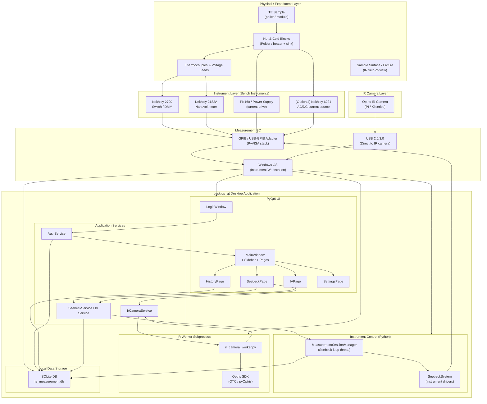
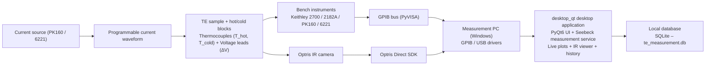

## TE Measurement System — Hardware-to-Desktop Overview

**Ikeda-Hamasaki Laboratory**  
Version 1.0 — March 2026

---

## 1. End-to-End Overview

This document gives a **single high-level view from physical hardware up to the `desktop_qt` PyQt6 application**.  
It is meant to complement `DESKTOP_QT_ARCHITECTURE.md` (which focuses on the desktop app internals).

---

## 2. Layered Architecture Diagram

The following diagram shows the complete stack, from the thermoelectric sample and sensors through the instruments, PC, and finally the desktop application and database.

---

## 3. Presentation-Style Overview Diagram

This diagram is a simplified, left-to-right view that matches the slide-style layout you showed.  
Use it as a reference when placing labels on your graphics.

---

## 4. Layer Descriptions

- **Physical / Experiment Layer**  
  Real-world hardware: thermoelectric sample, hot/cold blocks, and the thermocouples / voltage leads that sense temperatures and TE voltage. The IR camera observes the sample fixture to give a spatial temperature map.

- **Instrument Layer**  
  Bench instruments (Keithley 2182A, 2700, PK160, optional 6221) apply current and measure temperatures and thermoelectric voltage. They expose SCPI-style command interfaces over GPIB, which are abstracted by the `SeebeckSystem` driver in the desktop app.

- **IR Camera Layer**  
  The Optris IR camera provides time-synchronized thermal images for the sample region. It is controlled via the vendor SDK from an isolated subprocess to protect the main UI from DLL/COM crashes.

- **Measurement PC & OS Layer**  
  A dedicated Windows PC hosts the GPIB adapter and the USB-connected IR camera. PyVISA and the Optris SDKs are installed here. The `desktop_qt` Python environment runs entirely on this machine with no external network dependency.

- **Desktop Application Layer (`desktop_qt`)**  
  The PyQt6 application provides login, Seebeck and I–V measurement workflows, live plots, IR live view, and history export. Services such as `SeebeckService`, `MeasurementSessionManager`, and `IrCameraService` mediate between the UI and the instrument/IR layers.

- **Data Storage Layer (SQLite)**  
  All measurements, per-sample rows, integrity hashes, users, and labs are stored in a local SQLite database (`te_measurement.db` under `%APPDATA%`). The same schema and SQLAlchemy models are used across the desktop application.

---

## 5. How This Relates to Seebeck Measurements

During a Seebeck run:

- The **SeebeckPage** configures the current waveform and sample metadata.
- `SeebeckService` and `MeasurementSessionManager` translate this into a 1-second control loop that drives current via the instrument layer and acquires temperatures and TEMF.
- Each time step is committed to **SQLite**, and the desktop app simultaneously updates live plots such as **Seebeck coefficient vs. \(T_0\)** (the type of graph shown in your exports).
- The IR worker subprocess continuously streams frames to the UI so that thermal behavior can be correlated with the numerical Seebeck data.

